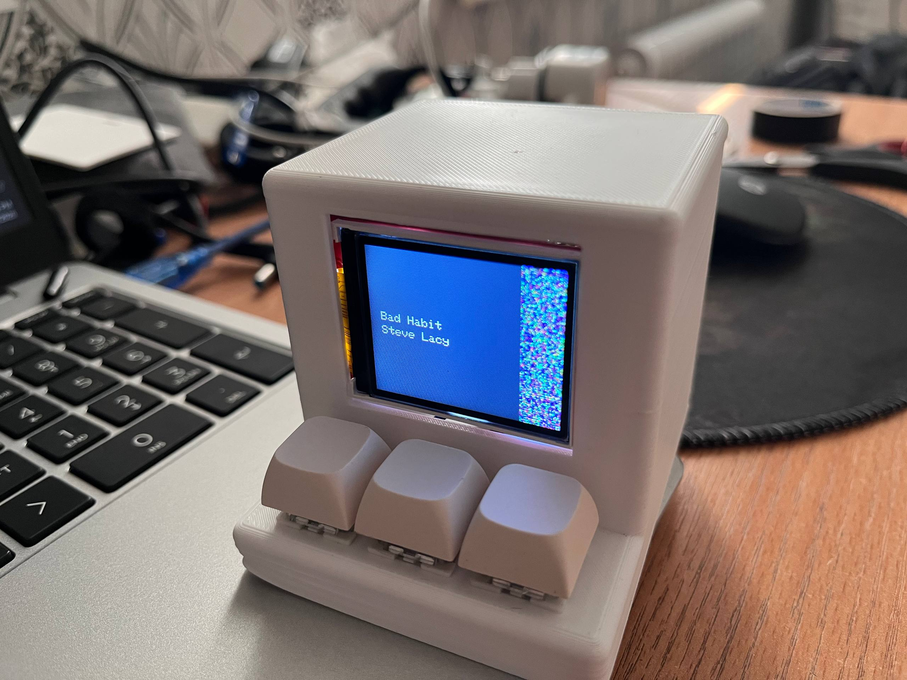
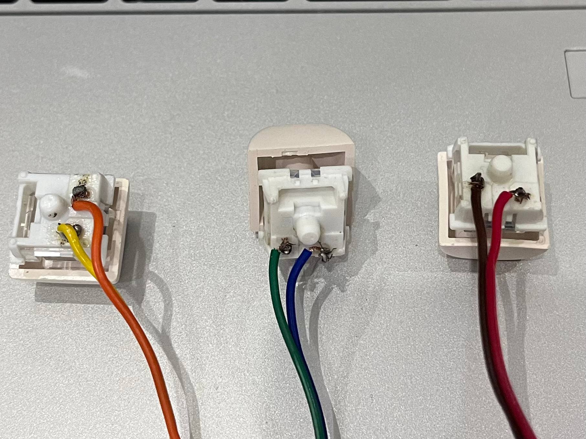
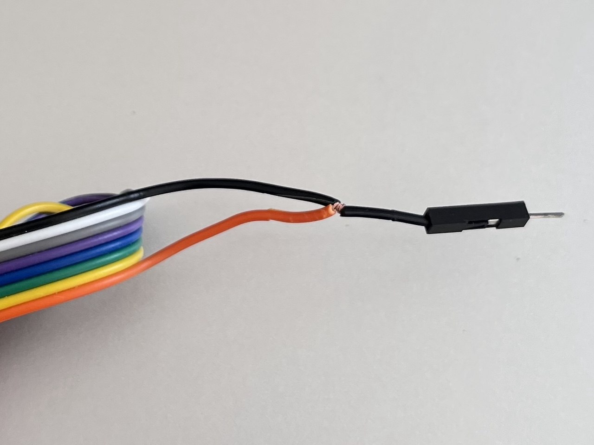
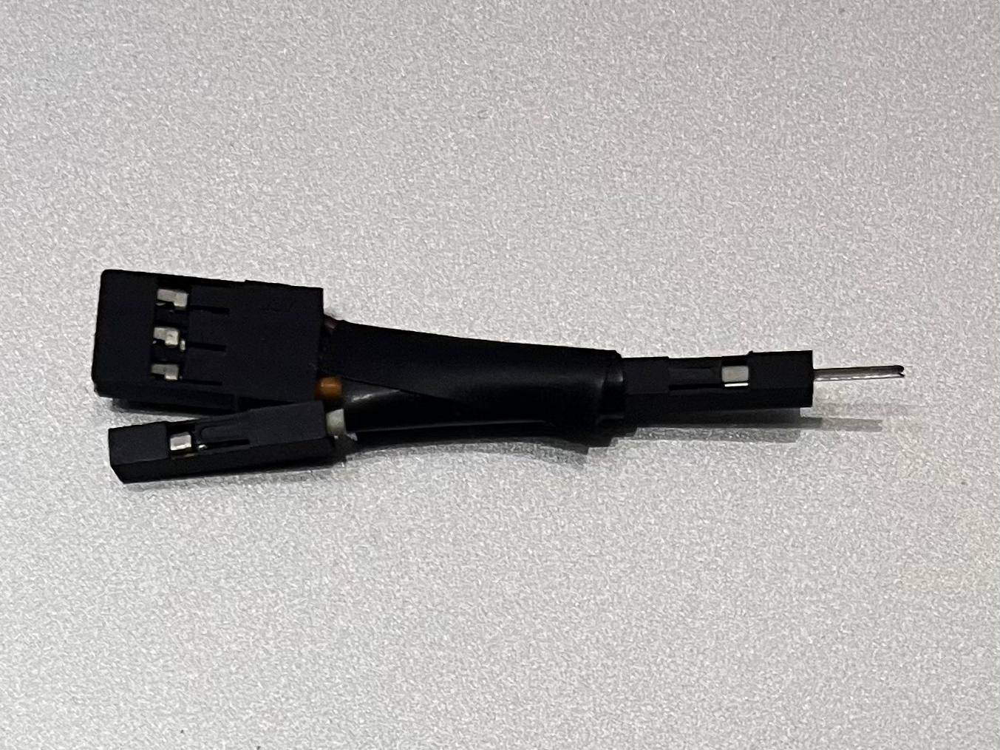
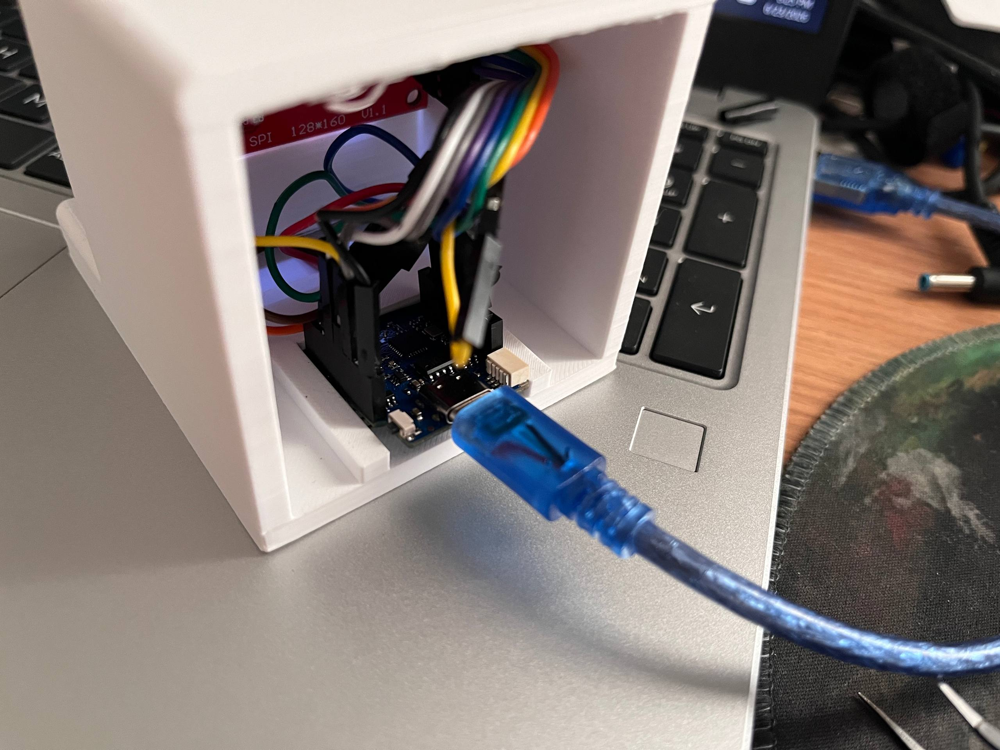
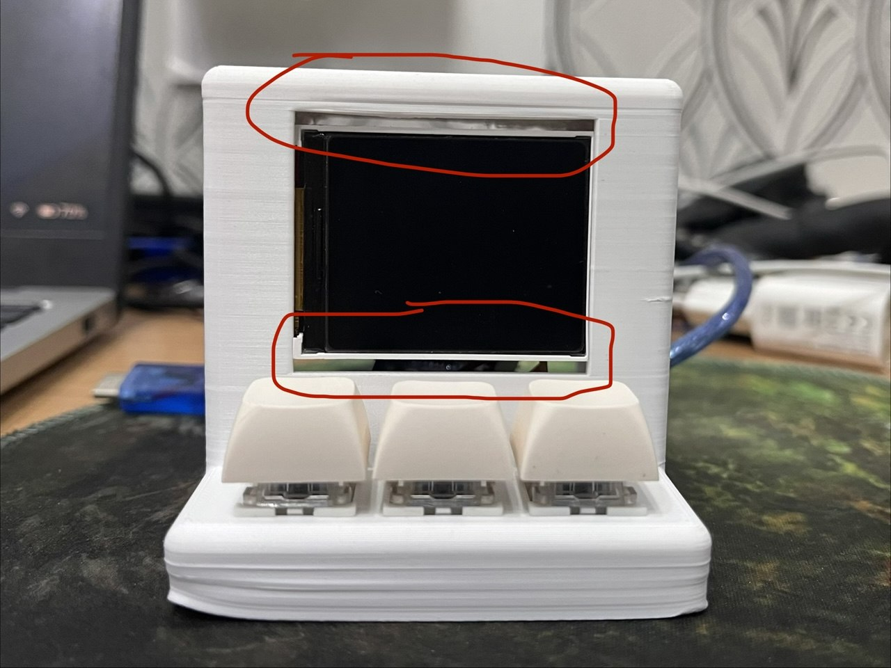

# Music Display



In starter projects I found this one most appealing to me. Cause it looks really cool. Honestly, guide is a bit confusing. Author gave example code for TFT display but used another type in CAD. These displays look identical but pinout is different. This led to misunderstanding in designing schematic. However, I eventually managed to do it

All CAD files in `CAD` folder

## Notes



Solder jumper wires to switches to easily connect them to the board



Connect VCC and LED together because only one 3.3V pin is available



Make this thing, so you can connect 4 GND pins to the board (3 for switches and 1 for display)

## Wiring

| ST7735S   | Lolin D1 Mini |
|-----------|---------------|
| VCC & LED | 3.3V          |
| SCK       | 14            |
| SDA       | 13            |
| A0        | 2             |
| RESET     | 0             |
| CS        | 16            |
| GND       | GND           |

Connect one side of switches to 4, 5, 12 and other side to GND

## Problems


I didn't consider that board height increases when you solder pin headers, and now its not fitting its place. Because of that lid isn't closing



The actual display size is smaller and leaves a annoying gap in the frame if you look straight to front. But it becomes less annoying if you look a bit upper

## Code

This code works on Windows, feel free to modify and adapt to other OS

### Setup PC
In `Code/For PC` folder there is a `server.py` file. You need to install libraries and launch it. This code works as a local API, which passes music data to board and manages playback controls depending on request

Alternatively, you can download executable version in Releases

### Setup board
- Download & Install [Thonny](https://thonny.org/)
- Upload all the files in `Code/For board` to Lolin D1 mini through Thonny
- Open `main.py` file and find these lines:

```
ssid = "WiFi Name"
password = "WiFi Password"
ip = "http://YOUR_IP:8000"
```

Change values to your WiFi's name and password, and IPv4 address of your PC. Don't remove or change port number if you didn't change server port

If you don't know IPv4 address of your PC, then go to `cmd` and type `ipconfig`

## Note before using
Launch the server code first, then board code and wait few seconds to let the board connect to your WiFi

## BOM

|Name            |Purpose                                                      |Cost Per Item (USD)|Quantity|Total (USD)|Link                                                              |Distributor           |
|----------------|-------------------------------------------------------------|-------------------|--------|-----------|------------------------------------------------------------------|----------------------|
|Delivery fee    |Delivery (Total is $9 so probably additional money is needed)|2.96               |1       |2.96       |https://stasis.hackclub-assets.com/images/1773853652043-gnu4af.png|AliExpress            |
|Case            |Enclosure. This is approximate price                         |6.50               |1       |6.50       |https://stasis.hackclub-assets.com/images/1773853059862-35wc3m.png|Hack Club Print Legion|
|MX Switches     |To make physical actions                                     |0.96               |1       |0.96       |https://ali.click/33q931u                                         |AliExpress            |
|1.8" TFT Display|Display data                                                 |1.44               |1       |1.44       |https://ali.click/8xp931q                                         |AliExpress            |
|White PBT keycap|Make clicking comfortable                                    |0.50               |3       |1.50       |https://ali.click/1jp931k                                         |AliExpress            |
|LOLIN D1 Mini   |Use as a brain                                               |1.48               |1       |1.48       |https://ali.click/icp931e                                         |AliExpress            |
|Jumper wires M-F|To connect display with board                                |0.64               |1       |0.64       |https://ali.click/czo931z                                         |AliExpress            |

