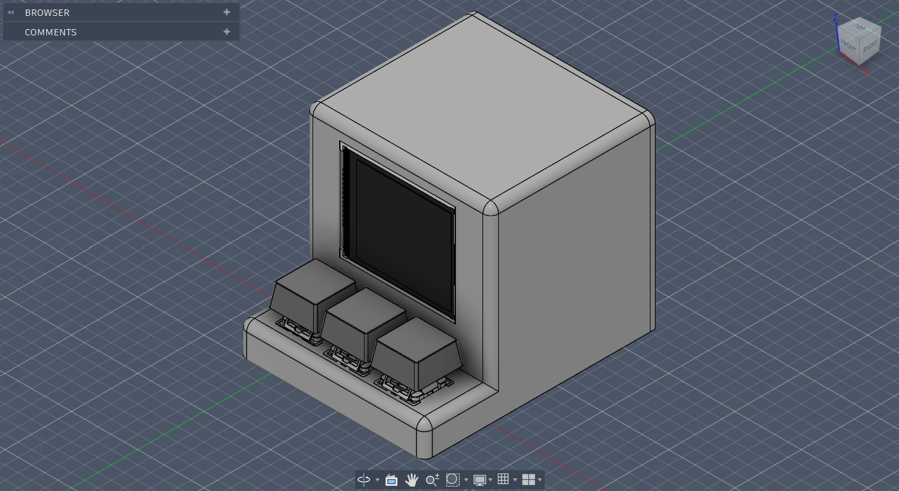

# Spotify Display

In starter projects I found this one most appealing to me. Cause it looks really cool. Honestly, guide is a bit confusing. Author gave example code for TFT display but used another type in CAD. These displays look identical but pinout is different. This led to misunderstanding in designing schematic. However, I eventually managed to do it

I designed the schematic in wokwi, you can access it [here](https://wokwi.com/projects/457768720294999041)

## BOM

|Name            |Purpose                                                      |Cost Per Item (USD)|Quantity|Total (USD)|Link                                                              |Distributor           |
|----------------|-------------------------------------------------------------|-------------------|--------|-----------|------------------------------------------------------------------|----------------------|
|Delivery fee    |Delivery (Total is $9 so probably additional money is needed)|2.96               |1       |2.96       |https://stasis.hackclub-assets.com/images/1773853652043-gnu4af.png|AliExpress            |
|Case            |Enclosure. This is approximate price                         |6.50               |1       |6.50       |https://stasis.hackclub-assets.com/images/1773853059862-35wc3m.png|Hack Club Print Legion|
|MX Switches     |To make physical actions                                     |0.96               |1       |0.96       |https://ali.click/33q931u                                         |AliExpress            |
|1.8" TFT Display|Display data                                                 |1.44               |1       |1.44       |https://ali.click/8xp931q                                         |AliExpress            |
|White PBT keycap|Make clicking comfortable                                    |0.50               |3       |1.50       |https://ali.click/1jp931k                                         |AliExpress            |
|LOLIN D1 Mini   |Use as a brain                                               |1.48               |1       |1.48       |https://ali.click/icp931e                                         |AliExpress            |
|Jumper wires M-F|To connect display with board                                |0.64               |1       |0.64       |https://ali.click/czo931z                                         |AliExpress            |

